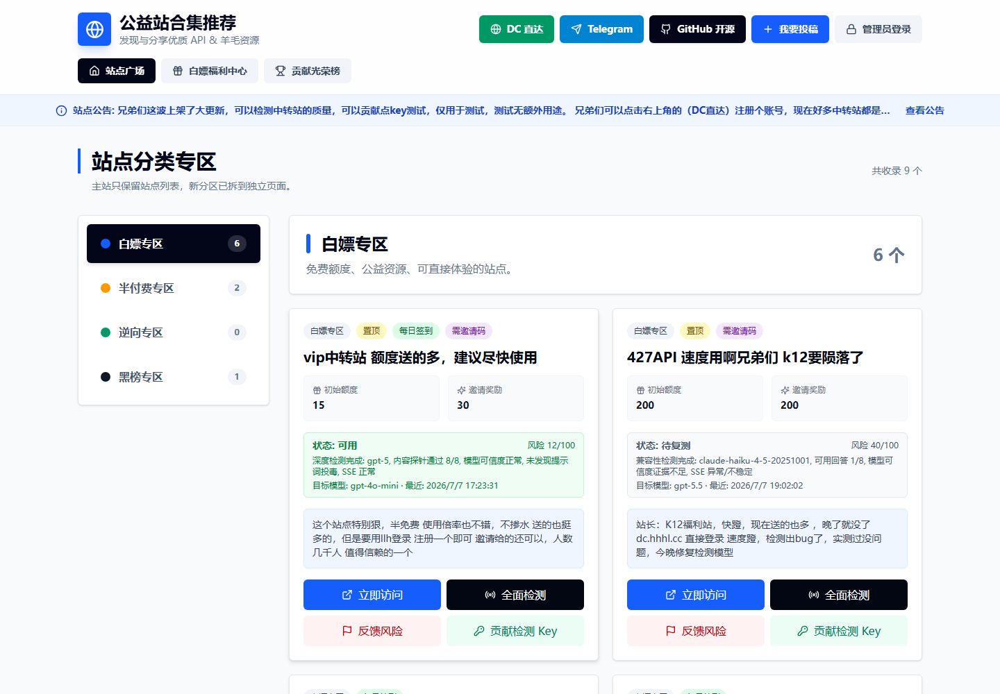
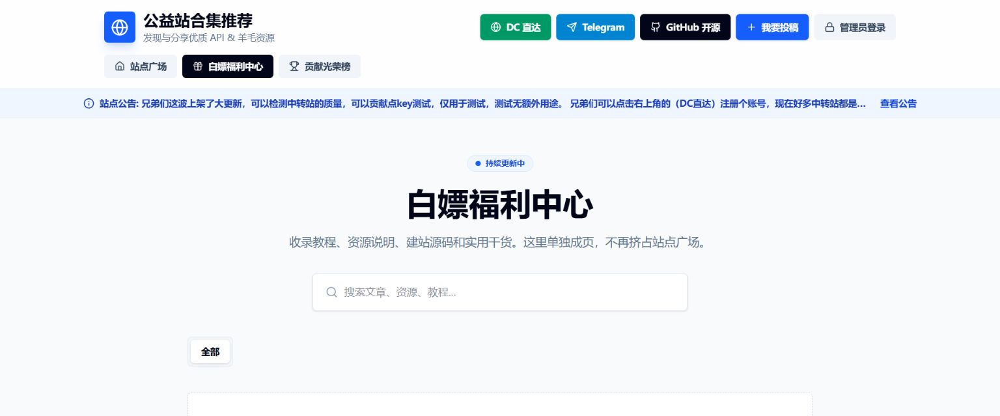

# 羊毛公益中转站

<h2>
  <a href="https://welfare.sstxww1.asia/">立即访问主站：welfare.sstxww1.asia</a>
</h2>

  

公益羊毛站合集、白嫖福利中心、投稿入口与风险反馈中心。

[立即访问网站](https://welfare.sstxww1.asia/) ·
[白嫖福利中心](https://welfare.sstxww1.asia/share) ·
[提交线索](https://welfare.sstxww1.asia/) ·
[TG 频道](https://t.me/djdhsjix6464)

## 实站预览

## 这是什么

羊毛公益中转站是一个面向普通用户的福利导航和风险反馈页面，用来整理公益羊毛站、免费资源入口、半付费资源、逆向专区站点以及需要谨慎访问的黑榜信息。

它不是单纯的链接堆叠页。站点会把投稿、举报、联通性检测、贡献 Key、光荣榜、福利分享文章和管理员审核流程放到同一个入口里，让用户能更快找到可用资源，也能把失效、跑路、乱答、疑似投毒等风险反馈回来。

## 这个仓库放什么

本仓库只用于展示网站入口、项目介绍、截图、投稿规则、维护说明和反馈入口。

本仓库不包含网站源码、不包含后台密码、不包含 Cloudflare 配置、不包含数据库备份、不包含检测 Key、不包含任何生产密钥。网站更新和数据维护都在正式站点与后台完成。

## 为什么值得收藏

| 能力 | 说明 |
| --- | --- |
| 分区清楚 | 白嫖专区、半付费专区、逆向专区、黑榜专区分开浏览，不把所有内容挤在一起。 |
| 地址保护 | 公开卡片不直接展示真实站点 URL，避免链接被批量抓取和滥用。 |
| 投稿审核 | 用户可以提交站点线索，管理员审核后再展示。 |
| 风险反馈 | 支持举报降智、乱答、疑似投毒、跑路、扣费异常、无法访问等问题。 |
| 检测辅助 | 支持联通性、模型可信度、响应洁净度、SSE 流式稳定性等检测结果展示。 |
| 光荣榜 | 贡献检测 Key 的用户可以留下名字，展示贡献次数、token 消耗和大家的点赞送花。 |
| 分享中心 | 白嫖福利中心支持图文教程、活动分享、资源说明和公告式内容沉淀。 |

## 功能概览

| 模块 | 当前状态 | 面向谁 |
| --- | --- | --- |
| 站点广场 | 已上线 | 所有访问用户 |
| 左侧分区导航 | 已上线 | 所有访问用户 |
| 我要投稿 | 已上线 | 资源贡献者 |
| 风险举报 | 已上线 | 所有访问用户 |
| 管理员审核 | 已上线 | 站点管理员 |
| 公告栏 | 已上线 | 站点管理员 |
| 白嫖福利中心 | 已上线 | 所有访问用户 |
| 图文文章管理 | 已上线 | 站点管理员 |
| 光荣榜 | 已上线 | Key 贡献者 |
| DC 直达 | 已上线 | 所有访问用户 |
| TG 频道入口 | 已上线 | 所有访问用户 |

## 专区说明

| 专区 | 收录方向 |
| --- | --- |
| 白嫖专区 | 免费、低门槛、普通用户可以直接体验的资源入口。 |
| 半付费专区 | 有免费额度或基础能力，但高级能力、额度或稳定性可能需要付费。 |
| 逆向专区 | 收录直接可以搞逆向的中转站，不用注入额外提示词。 |
| 黑榜专区 | 已发现明显异常、风险较高、疑似跑路、扣费异常或需要谨慎访问的站点。 |

## 风险状态

| 状态 | 含义 |
| --- | --- |
| 可用 | 基础访问正常，近期检测未发现明显异常。 |
| 疑似降级 | 多项证据显示可能存在模型错配、假模型、降级模型或响应质量异常。 |
| 疑似投毒 | 检测到隐藏提示词、泄密诱导、异常命令或工具调用注入风险。 |
| 高风险 | 多项检测异常，或举报与复核结果显示风险较高。 |
| 待复测 | 缺少有效检测条件、近期异常待确认，或需要管理员复核。 |

检测结果只能作为辅助判断。第三方站点随时可能调整策略、额度、模型和访问限制，访问前仍需自行判断风险。

## 如何使用

1. 打开 [welfare.sstxww1.asia](https://welfare.sstxww1.asia/)。
2. 在左侧选择想看的专区，默认进入白嫖专区。
3. 看到感兴趣的站点后，点击卡片里的访问按钮。
4. 如果发现失效、乱答、疑似投毒、跑路或扣费异常，在站点卡片里提交反馈。
5. 想看教程、活动或图文分享，进入 [白嫖福利中心](https://welfare.sstxww1.asia/share)。

## 投稿与反馈

优先使用正式网站里的“我要投稿”和“反馈失效/风险”入口，这样管理员可以直接在后台处理。

也可以通过 GitHub Issues 补充线索：

- [提交新站点](https://github.com/sstxww/yangmao-fuli-zhongzhuanzhan/issues/new/choose)
- [反馈问题](https://github.com/sstxww/yangmao-fuli-zhongzhuanzhan/issues)

投稿建议提供以下信息：

| 信息 | 说明 |
| --- | --- |
| 站点名称 | 尽量写清楚，不要只写“这个不错”。 |
| 访问链接 | 站点首页或邀请链接。 |
| 所属分类 | 白嫖、半付费、逆向或黑榜线索。 |
| 简短说明 | 免费额度、使用限制、是否需要登录、是否限时。 |
| 风险提示 | 是否出现乱答、扣费异常、跳转异常、疑似投毒等情况。 |

## 光荣榜

贡献检测 Key 的用户会进入光荣榜。页面会展示贡献者名称、贡献站点、检测次数、token 消耗、估算成本、点赞和送花数据。

Key 原文不会公开，不会回显给前端，也不会写进这个仓库。贡献记录的目标是感谢参与维护的人，让大家知道是谁在帮助社区把风险检测做得更准。

## 数据与安全边界

- 公开 API 不返回真实站点 URL。
- 公开 API 不返回检测 Key 原文、加密字段、后台密钥或生产配置。
- 检测 Key 验证失败会丢弃，验证成功后只用于对应站点检测。
- 投稿、登录、举报、贡献 Key 等入口接入人机验证与限速。
- 管理员操作使用后台审核，不会因为多人举报就自动公开拉黑。
- 本仓库只保留介绍、规则和截图，不发布源码。

## 维护原则

| 原则 | 说明 |
| --- | --- |
| 公益优先 | 优先收录免费、低门槛、对普通用户有实际帮助的资源。 |
| 人工复核 | 投稿、举报、黑榜确认和重要状态调整都需要管理员处理。 |
| 风险克制 | 不用一次失败就乱判降级，尽量用多轮证据降低误判。 |
| 持续清理 | 失效、变质、争议较大的站点会被复测、下架或移入黑榜。 |

## 相关入口

| 入口 | 地址 |
| --- | --- |
| 正式网站 | https://welfare.sstxww1.asia/ |
| 白嫖福利中心 | https://welfare.sstxww1.asia/share |
| DC 一键直达 | https://dc.hhhl.cc |
| TG 频道 | https://t.me/djdhsjix6464 |
| GitHub 仓库 | https://github.com/sstxww/yangmao-fuli-zhongzhuanzhan |

## 免责声明

所有外部站点信息都有时效性。访问第三方站点时，请自行判断风险，不要提交敏感账号、验证码、支付信息、私密 API Key 或隐私资料。本项目只做信息整理、风险提示和社区反馈，不对第三方站点的可用性、安全性、收费行为或服务结果作保证。

## 关键词

公益导航、羊毛网站、免费福利、福利合集、白嫖资源、资源导航、OpenAI 中转站、AI 中转站、逆向专区、风险检测、黑榜、投稿审核、福利分享中心、光荣榜。

觉得这个站点有用的话，可以点一个 Star，让更多人找到它。

[访问网站](https://welfare.sstxww1.asia/) · [提交反馈](https://github.com/sstxww/yangmao-fuli-zhongzhuanzhan/issues)

